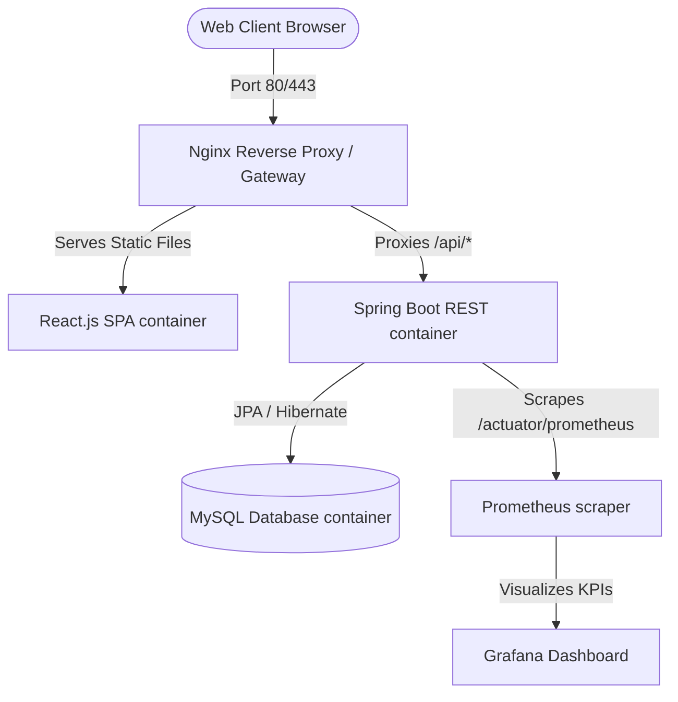
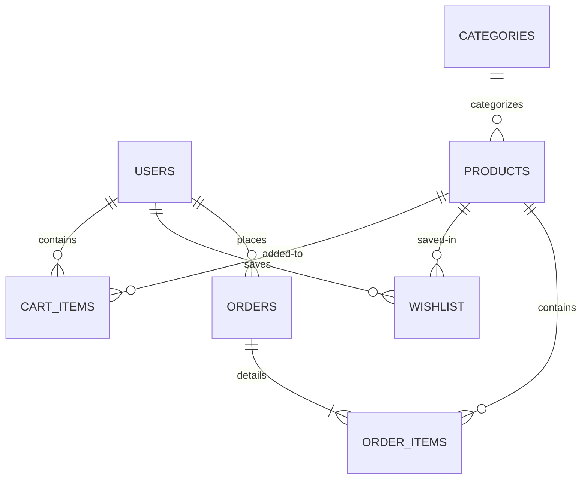
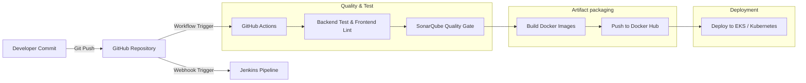
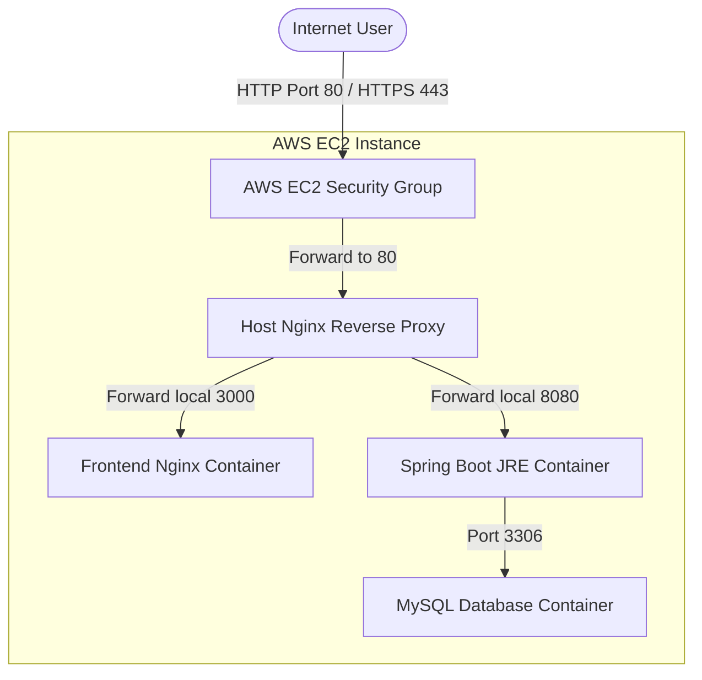

# QuantumShop - Full Stack Production-Level E-Commerce Platform

QuantumShop is a production-style, DevOps-integrated full stack E-Commerce platform. It is engineered to demonstrate professional developer competencies across React frontend SPA design, Spring Boot REST architecture, MySQL relational database modeling, containerized orchestration, automated CI/CD pipelines, Kubernetes deployments, and cloud infrastructure monitoring.

---

## 1. System Architecture



---

## 2. Entity-Relationship (ER) Diagram



---

## 3. CI/CD Automation Flow



---

## 4. Cloud Deployment Architecture (AWS EC2)



---

## 5. Directory Structure

```text
d:/ecommerce/
├── backend/                  # Java Spring Boot Service
│   ├── src/main/java/        # Clean Layered Code (Controller, Service, Repository, Model, DTO, Security)
│   ├── src/main/resources/   # Properties & configurations
│   ├── Dockerfile            # Multi-stage JAR builder
│   └── pom.xml               # Maven configuration
├── frontend/                 # React.js Vite Application
│   ├── src/                  # Components, Pages, Slices, Contexts, Hooks, Styles
│   ├── nginx.conf            # Container route routing
│   ├── tailwind.config.js    # Styling specifications
│   ├── vite.config.js        # Local compiler & proxy mapping
│   └── Dockerfile            # Multi-stage static assets Nginx compilation
├── kubernetes/               # Orchestration manifests
│   ├── configmap.yaml        # Environments map
│   ├── secrets.yaml          # Base64 authentication keys
│   ├── db-deployment.yaml    # MySQL workload & PVC
│   ├── backend-deployment.yml# Spring Boot backend pods
│   ├── frontend-deployment.yaml# Nginx frontend React pods
│   └── ingress.yaml          # Cluster ingress router
├── prometheus/               # Monitoring files
│   └── prometheus.yml        # Metrics scraping configuration
├── postman/                  # Integration testing collections
│   └── ecommerce_postman_collection.json
├── docker-compose.yml        # Unified container network orchestrator
├── Jenkinsfile               # Jenkins Pipeline script
├── schema.sql                # SQL creation schema & seeds
└── README.md                 # Project instruction manual
```

---

## 6. Local Installation & Run Guide

### Option A: One-Click Launch via Docker Compose (Recommended)
Required: [Docker Desktop](https://www.docker.com/products/docker-desktop/) installed and running.

1. Clone or download this project workspace.
2. In the root directory `d:\ecommerce`, run:
   ```bash
   docker-compose up --build -d
   ```
3. Once running, access the services:
   - **Frontend App**: `http://localhost:3000` (Nginx static bundle, proxies `/api` requests automatically)
   - **Backend Actuator / REST APIs**: `http://localhost:8080`
   - **Swagger Docs**: `http://localhost:8080/swagger-ui/index.html`
   - **Prometheus Monitor**: `http://localhost:9090`
   - **Grafana Panel**: `http://localhost:3001` (Default credentials: `admin` / `admin`)
4. To shut down and clear volumes:
   ```bash
   docker-compose down -v
   ```

### Option B: Running from Source Code (Development Mode)
Required: [Java 17 JDK](https://www.oracle.com/java/technologies/downloads/#java17), [Maven](https://maven.apache.org/download.cgi), and [NodeJS 18+](https://nodejs.org/).

#### Step 1: Run MySQL Database
Start a local MySQL service on port `3306` with username `root` and password `rootpassword`. Initialize the tables using:
```bash
mysql -u root -prootpassword < schema.sql
```

#### Step 2: Start the Java Backend
```bash
cd backend
mvn clean install
mvn spring-boot:run
```
*The server will boot up at `http://localhost:8080`.*

#### Step 3: Start the React Frontend
```bash
cd frontend
npm install
npm run dev
```
*Vite compiles assets and opens the browser on `http://localhost:3000`.*

---

## 7. Kubernetes Deployments

Make sure a local cluster (e.g. Minikube, Docker Desktop K8s, or cloud-native AWS EKS) is running.

1. Deploy Configuration Map and Secrets:
   ```bash
   kubectl apply -f kubernetes/configmap.yaml
   kubectl apply -f kubernetes/secrets.yaml
   ```
2. Launch Persistent Volumes and Database:
   ```bash
   kubectl apply -f kubernetes/db-deployment.yaml
   ```
3. Deploy Spring Boot REST Container and React Static Container:
   ```bash
   kubectl apply -f kubernetes/backend-deployment.yaml
   kubectl apply -f kubernetes/frontend-deployment.yaml
   ```
4. Deploy Ingress Controller Rules:
   ```bash
   kubectl apply -f kubernetes/ingress.yaml
   ```
5. Check deployment status:
   ```bash
   kubectl get all
   ```

---

## 8. AWS EC2 Deployment Guides

We provide multiple robust ways to deploy QuantumShop to AWS EC2:

### Option A: Automatic Provisioning & Deployment via Terraform (Recommended)
This method provisions the VPC, Subnets, Security Groups, and EC2 instance, installs Docker & Docker Compose, and starts the container group automatically.

1. Navigate to the Terraform folder:
   ```bash
   cd aws-ec2/terraform
   ```
2. Initialize Terraform and install plugins:
   ```bash
   terraform init
   ```
3. Customize deployment variables:
   - Create a `terraform.tfvars` file to override default settings (e.g. key_name, region, instance size).
   ```hcl
   aws_region   = "us-east-1"
   key_name     = "your-aws-ssh-key-name"
   instance_type = "t3.medium"
   ```
4. Verify changes and apply:
   ```bash
   terraform plan
   terraform apply
   ```
5. After a few minutes, copy the `app_url` from the outputs and view the running e-commerce store in your browser!

---

### Option B: Deploying on an Existing EC2 Instance (Docker Compose)
If you already have a running Ubuntu instance and want a lightweight container deployment.

1. SSH into your Ubuntu EC2 instance.
2. Copy the `aws-ec2/deploy-docker-ec2.sh` script to your server, or clone the repository directly:
   ```bash
   git clone https://github.com/preethamvs6/e-commerce-.git ecommerce
   cd ecommerce
   ```
3. Run the deployment script with root permissions:
   ```bash
   sudo ./aws-ec2/deploy-docker-ec2.sh
   ```
4. The script will install Docker & Docker Compose, construct a default `.env` file, pull the production images, and launch the application.

---

### Option C: Deploying on an Existing EC2 Instance (K3s Kubernetes)
For a single-instance Kubernetes setup, leveraging the cluster manifests.

1. SSH into your Ubuntu EC2 instance.
2. Clone the repository and navigate into it:
   ```bash
   git clone https://github.com/preethamvs6/e-commerce-.git ecommerce
   cd ecommerce
   ```
3. Run the K3s deployment initializer:
   ```bash
   sudo ./kubernetes/deploy-k3s-ec2.sh
   ```
4. Follow the final instructions printed by the script to apply the Kubernetes manifests inside the `kubernetes/` folder.

---

## 9. REST API Documentation Summary

Exhaustive interactive descriptions are visible in **Swagger UI** (`http://localhost:8080/swagger-ui.html`).

| Method | Endpoint | Description | Auth Role |
| :--- | :--- | :--- | :--- |
| **POST** | `/api/auth/register` | Create user profile and obtain JWT token | Public |
| **POST** | `/api/auth/login` | Log in to account and obtain JWT token | Public |
| **GET** | `/api/auth/me` | Fetch active user profile details | USER / ADMIN |
| **PUT** | `/api/auth/profile` | Update address/phone of current user | USER / ADMIN |
| **GET** | `/api/products` | Retrieve products (paginated, sorted, searchable) | Public |
| **GET** | `/api/products/{id}` | Get product details by ID | Public |
| **POST** | `/api/products` | Add new catalog product | ADMIN |
| **DELETE** | `/api/products/{id}` | Delete product from catalog | ADMIN |
| **GET** | `/api/cart` | Retrieve current user's shopping cart | USER |
| **POST** | `/api/cart` | Add product to cart | USER |
| **PUT** | `/api/cart/{productId}` | Update quantity of cart item | USER |
| **DELETE** | `/api/cart/{productId}` | Remove product from cart | USER |
| **POST** | `/api/orders` | Checkout cart items and place order | USER |
| **GET** | `/api/orders` | Retrieve purchase history of user | USER |
| **GET** | `/api/admin/analytics` | Get gross revenues, users, and orders metrics | ADMIN |
| **PUT** | `/api/admin/orders/{id}/status` | Update fulfillment state of order | ADMIN |

---

## 10. API Testing Collection

Import `postman/ecommerce_postman_collection.json` directly into Postman.
- The collection uses local environment variables: `baseUrl` (defaults to `http://localhost:8080`).
- Login requests feature automated test scripts that capture the returned JWT token, storing it as `jwt_token` inside the environment so subsequent secure queries authenticate instantly.
